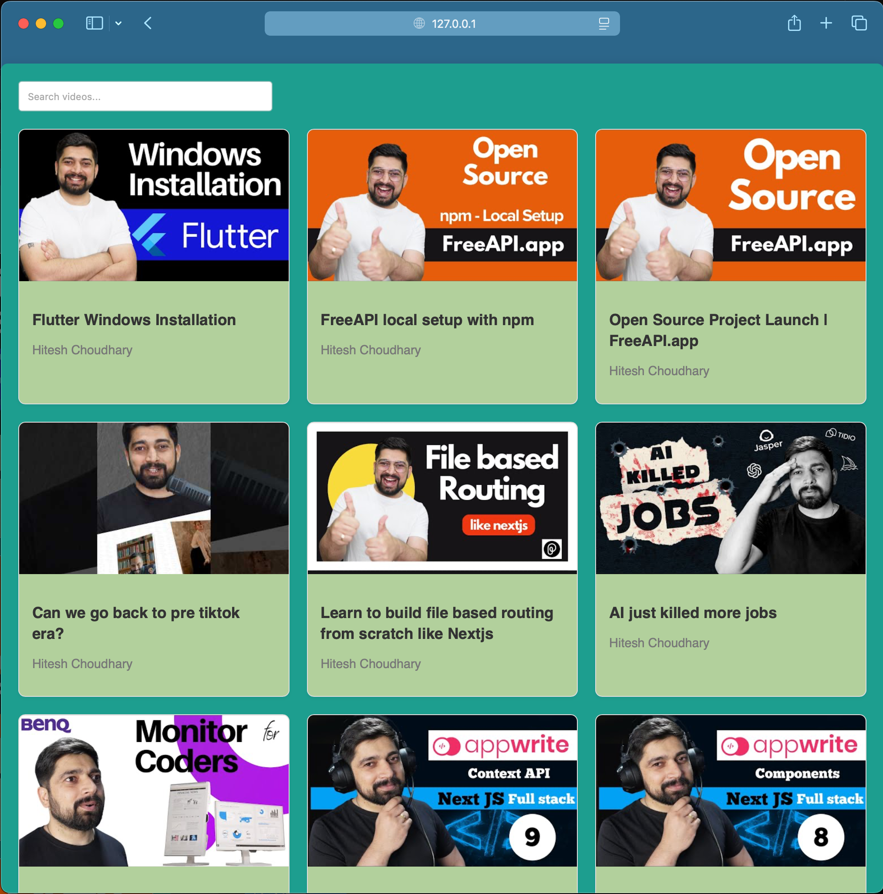
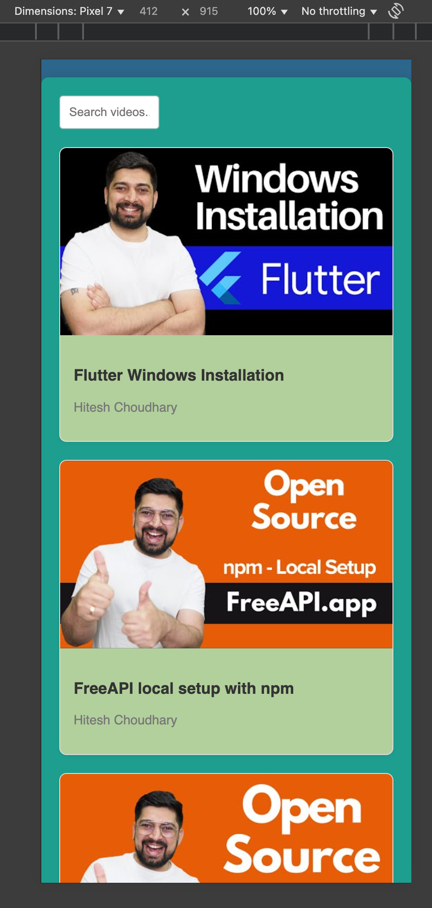

# YouTube Video Listing

A modern, responsive web application that presents a curated collection of YouTube videos in an elegant grid layout. The application fetches video data from freeapi.app and provides a seamless way to search and access YouTube content.

## Live link
[click here](https://suuumans.github.io/youtube-video-listing/)

## 📸 Screenshots

<div style="display: flex; gap: 10px;">
    
    
</div>

## 📝 Description

The YouTube Video Listing application is designed to showcase YouTube videos in a clean, organized interface. It retrieves video data from an external API, allowing users to browse through a collection of videos without navigating through YouTube directly. The application includes search functionality to help users quickly find videos of interest and provides direct links to watch the selected videos on YouTube.

## ✨ Features

- **Video Grid Layout**: Displays videos in a responsive, visually appealing grid
- **Search Functionality**: Enables filtering videos by title or description
- **Responsive Design**: Optimized for various screen sizes (mobile, tablet, desktop)
- **Video Details**: Shows title, thumbnail, view count, and upload date for each video
- **Direct YouTube Links**: Each video card links to the actual YouTube video
- **Loading States**: Visual indicators while content is being fetched
- **Error Handling**: Graceful handling of API errors and network issues

## 🛠️ Technologies Used

- **HTML5**: Semantic markup for structure
- **CSS3**: 
  - Flexbox and Grid for layout
  - Media queries for responsiveness
  - CSS variables for consistent theming
- **JavaScript (ES6+)**:
  - Fetch API for data retrieval
  - DOM manipulation
  - Event handling
  - Local storage for state persistence
- **API**: freeapi.app for YouTube video data
- **Version Control**: Git/GitHub

## 📋 Prerequisites

- Modern web browser (Chrome, Firefox, Safari, Edge)
- Internet connection (for API access)

## 🚀 Installation

1. **Clone the repository**
   ```bash
   git clone https://github.com/suuumans/youtube-video-listing.git
   ```

2. **Navigate to project directory**
   ```bash
   cd youtube-video-listing
   ```

3. **Open the application**
   - Simply open the `index.html` file in your web browser
   - Alternatively, use a local development server:
     ```bash
     # If you have Python installed
     python -m http.server
     
     # If you have Node.js installed
     npx serve
     ```

## 💻 Usage

1. **Browse Videos**: Scroll through the video grid to explore available content
2. **Search Videos**: Use the search bar at the top to filter videos by keyword
3. **Watch Videos**: Click on any video card to open and watch the video on YouTube
4. **Video Information**: Hover over video cards to see additional details

## 🧪 API Reference

The application uses the [freeapi.app](https://freeapi.app) API to fetch YouTube video data. The API provides:

- Video thumbnails
- Video titles and descriptions
- View counts and publication dates
- YouTube video URLs

## 🔮 Future Enhancements

- **User Authentication**: Allow users to create accounts and save favorite videos
- **Custom Playlists**: Enable creation of personalized video collections
- **Video Categories**: Implement filtering by video categories or tags
- **Dark Mode**: Add toggle for light/dark theme
- **Pagination**: Implement pagination for large video collections
- **Video Player Integration**: Embed YouTube player directly in the application
- **PWA Support**: Convert to Progressive Web App for offline functionality
- **Social Sharing**: Add buttons to share videos on social media platforms

## 🤝 Contributing

Contributions are welcome! Please feel free to submit a Pull Request.

1. Fork the repository
2. Create your feature branch (`git checkout -b feature/amazing-feature`)
3. Commit your changes (`git commit -m 'Add some amazing feature'`)
4. Push to the branch (`git push origin feature/amazing-feature`)
5. Open a Pull Request

## 📄 License

This project is licensed under the MIT License - see the LICENSE file for details.

## 👏 Acknowledgements

- [freeapi.app](https://freeapi.app) for providing the YouTube video API
- [FontAwesome](https://fontawesome.com) for icons (if used)
- All open source libraries and tools used in this project

